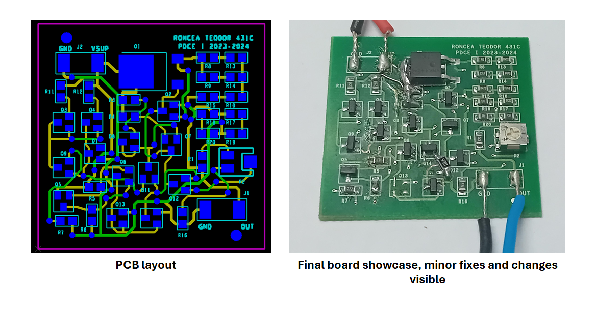
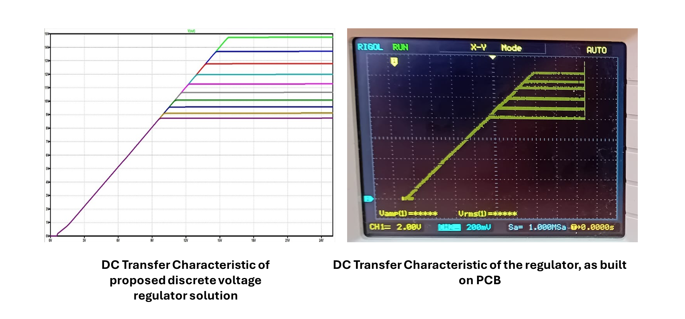
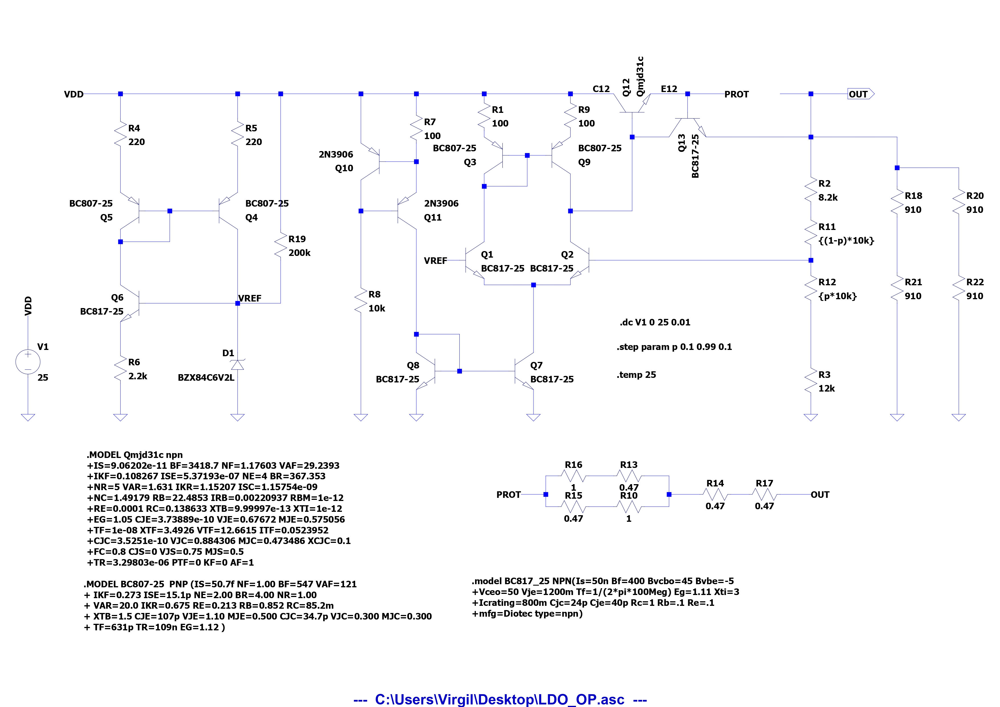

# PROJECT 1 DCE - Designing a discrete Series Voltage Regulator
## [NEW] Showcase of finalized design 
The project is now over, the final board has been assembled and tested. After some minor fixes and improvements we have a fully functional voltage regulator, behaving as expected.

 
  

    
     
     
    <a><b>PCB board layout and the populated board in real life</b></a>

 

 
  

    
     
     
    <a><b>DC transfer characteristic of realized voltage regulator</b></a>

 

## Short Description
As part of our studies in the fifth semester of Electrotechnical Ingineering, we were tasked with designing a fully-discrete **Series Voltage Regulator** and preparing the PCB layout for manufacturing.

Key design targets were:
- Open-loop Gain (AOL) of at least 100
- Over-current protection
- Low output voltage thermal coefficient, preferably under 2mV/degree Celsius
- Variable output voltage between 9V and 14.4V, with minimal output voltage droop at a maximum load of 900 Ohms

More information about the design considerations, the safety margins and cosniderations can be found in the full report on the project, available <a href="https://github.com/Riggstadt/PROIECT_1_ETTI/blob/main/DOCUMENTATION/DOCUMENTATIE_P1_SERS_N18_RONCEA_TEODOR_VIRGIL_431C.pdf">here</a>.

I choose a simple, yet robust topology for my voltage regulator circuit. The regulator is centered on a simple error amplifier, built upon a differential pair, with current mirror load and emitter degeneration. As control element, a high-power DPAK Bipolar Transistor was used, in conjuction with the resistive feedback network. The reference voltage source of the regulator is provided by a self-biased voltage reference.

 
  

    
     
     
    <a><b>Circuit schematic of the finalized Voltage Regulator, with corrections and improvements depicted</b></a>

 

The (to me) most interesting part of the whole circuit is the voltage reference block, a type of self-biased reference, with its design inspired by a similar subcircuit presented on Ken Sheriff's <a href="https://www.righto.com/2020/09/how-to-multiply-currents-inside.html">blog</a>, see Note #12 at the bottom of the article. The voltage reference is simplified, in order to conform to the constraints on component usage, but it still remains a stable reference, with low temperature dependance and high ripple rejection.

The over-current protection network takes the form of a simple current limiter, with all components used having been confirmed to resist the maximum possible dissipated power.

## Lessons learned and possible improvements
This exercise in basic circuit design has taught me many lessons, such as:
- The necessity of start-up circuits for self-biased references
- The importance of proper thermal analysis for even basic components
- The inherent variations between components, even when from the same lot, or sample
- The need for accurate Spice models

Some further improvements could be made to this Voltage Regulator, such that it can attain a higher degree of stability:
- The addition of an "in-chip" compensation network to set a clear dominant pole
- The replacement of the BJT-based Control Element with a MOSFET equivalent, for lower drop-out voltage, lower on-resistance, higher off-resistance and so on
- The enlargement of the PCB dimensions (constrained by design directives) and accommodation of a large copper pour, for thermal considerations

## Notes and useful sources
A more complete selection of resources can be found  <a href="https://github.com/Riggstadt/PROIECT_1_ETTI/blob/main/DOCUMENTATION/DOCUMENTATIE_P1_SERS_N18_RONCEA_TEODOR_VIRGIL_431C.pdf">here</a>, in the full report on the design process considerations.
